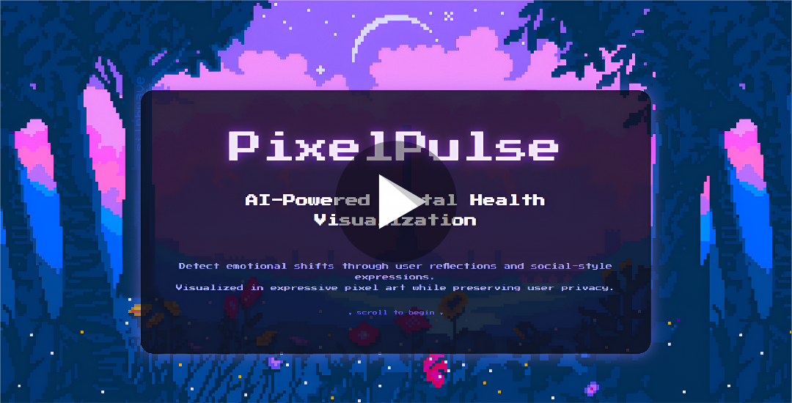

# 🎨 PixelPulse

**PixelPulse** is an AI-powered mental health visualization tool that interprets user input (like journal entries) to detect mood and then generates pixel-style emotional art using p5.js.

Built as a creative blend of AI, generative visuals, and mental wellness tracking, PixelPulse is designed to be both expressive and accessible.

---

## 🚀 Live Demo

Experience PixelPulse live here: **[https://pixel-pulse-one.vercel.app/](https://pixel-pulse-one.vercel.app/)**

---

## 🔹 Features

- Analyze natural language input (journal-style or social prompts)
- Detect mood and emotion using AI (powered by **Gemini API**)
- Visualize moods through pixel-style animations
- Lightweight, interactive frontend using p5.js

---

## 🔹 How to Use (Live Version)

1.  Click on the **Live Demo** link above to open PixelPulse in your web browser.
2.  Enter a journal-style message in the input field.
3.  Submit to analyze your mood.
4.  Watch a pixel-art representation of your emotion appear and animate!

> This is a browser-based tool — no installations required!

---

## 🔹 Technologies Used

-   HTML, CSS, JavaScript
-   p5.js – for generative pixel visuals
-   **Gemini API** – for mood analysis (securely handled via Vercel Serverless Functions)
-   GitHub Pages (for source code)
-   **Vercel** – for hosting and serverless functions

---

## 🔹 Demo Video

